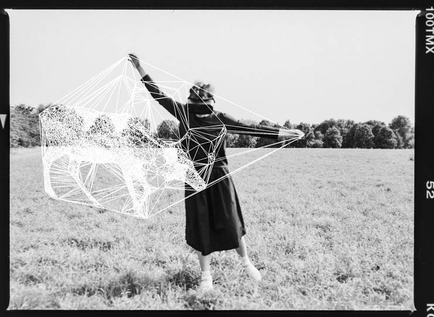

<!-- ### Hi there 👋

<!--
**pandmi/pandmi** is a ✨ _special_ ✨ repository because its `README.md` (this file) appears on your GitHub profile.

Here are some ideas to get you started:

- 🔭 I’m currently working on ...
- 🌱 I’m currently learning ...
- 👯 I’m looking to collaborate on ...
- 🤔 I’m looking for help with ...
- 💬 Ask me about ...
- 📫 How to reach me: ...
- 😄 Pronouns: ...
- ⚡ Fun fact: ...
-->
### Hello World 👋
I am a Digital Marketing Analyst and Consultant from Berlin, with a background in modern communication studies and knowledge of mathematical statistics, expertise in collecting and proceeding data, descriptive and explanatory analysis, building machine learning models, creating data visualization, translating insights into client recommendations.
- 🔭 Working on multiple marketing analytics and automatization project using Jupyter Lab, Python, Tensorflow, FastAPI and Docker
- 👯 I’m looking to collaborate on natural language generation as well as generative coding projects
- 💬 Ask me about SEM, Social Media Marketing, RTB and Programmatic
- 🌱 Learning artificial intelligence in depth
 
### Connect with me

 

 
 
<!-- ## Expertise

 
  -->
